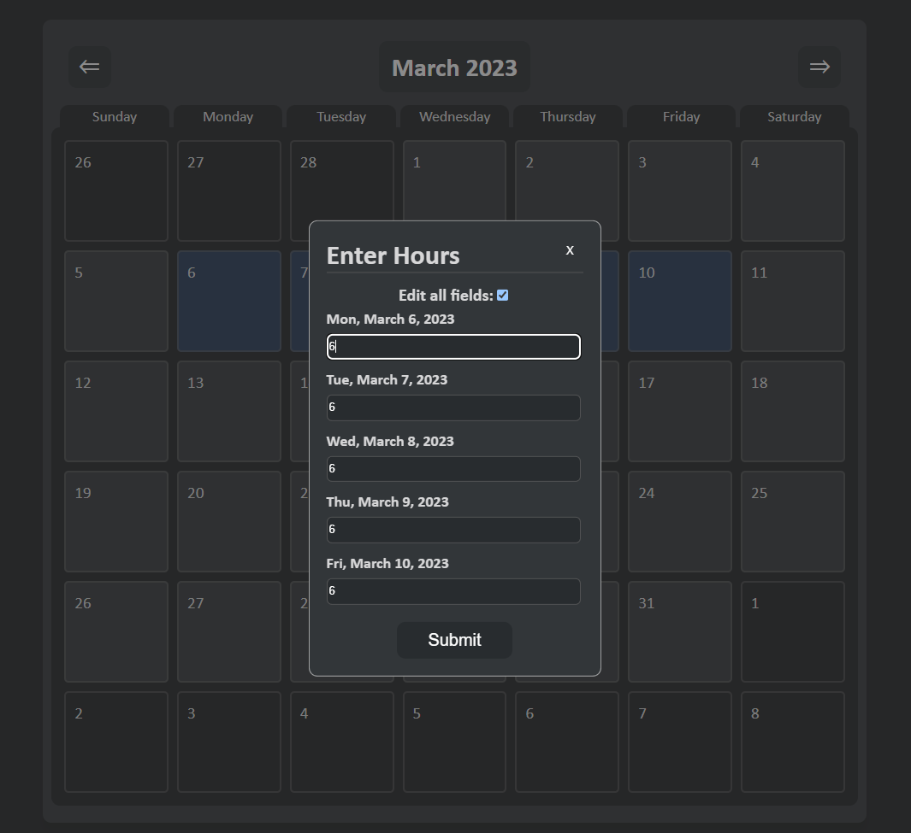
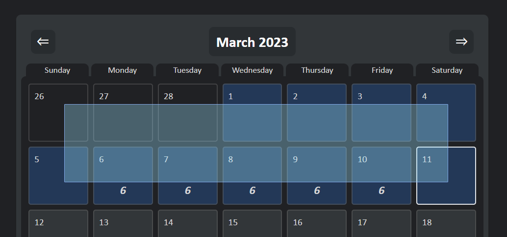
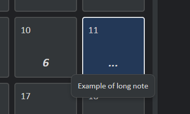

# Employee Timesheet

This project is a collaborative work of [Alick Zhang](https://github.com/AlickZhangGit) and [Arnold Hsieh](https://github.com/arnh8)

### Features

- Login and register account
- Enter and retrieve timesheet data
- Select multiple days on the calendar with drag select

### Front-end Tech Stack

- React
- HTML
- CSS
- @viselect/react

### Back-end Tech Stack

- AWS EC2 Ubuntu server
- AWS RDS PostgreSQL database
- Node.js
- Express.js
- Typescript

### Links

- View it [here!](https://ec2-52-72-138-30.compute-1.amazonaws.com:6969/)

### Screenshots

- Entering timesheet data

- Drag to select multiple days

- Hover to reveal notes

